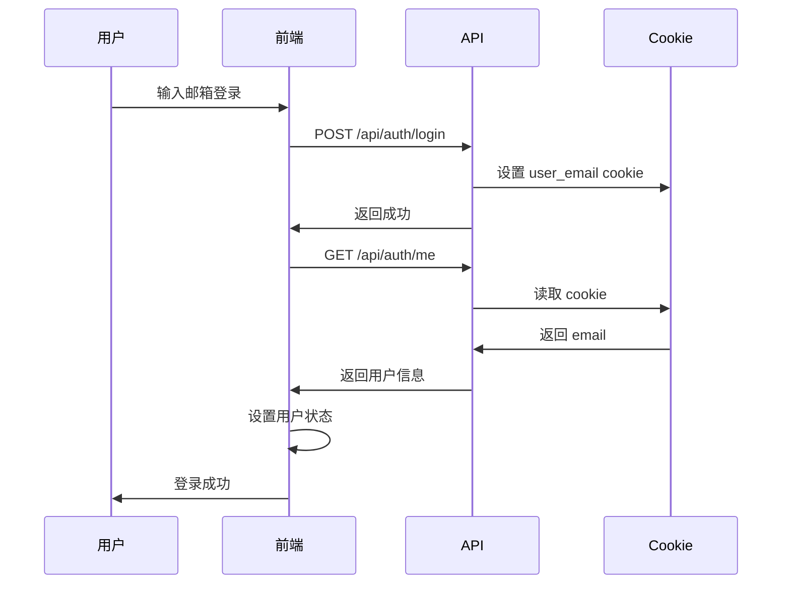
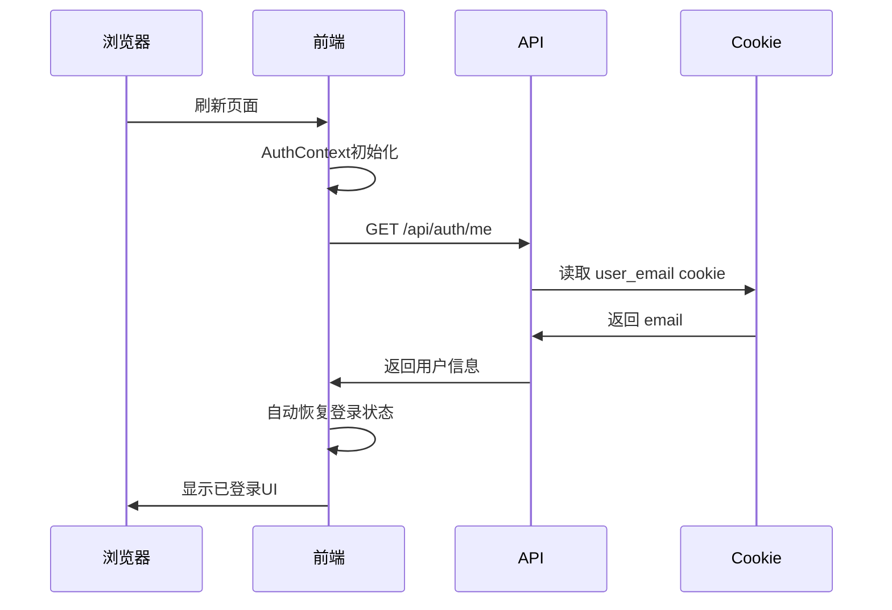

# 用户认证持久化 - 实现文档

> **更新时间**: 2025-10-09  
> **状态**: ✅ 已实现

## 📋 问题

用户登录后，刷新浏览器页面需要重新登录，体验不佳。

## ✅ 解决方案

实现基于 **Cookie** 的持久化登录状态，页面刷新后自动恢复登录。

---

## 🔧 实现细节

### 1. Cookie 存储机制

#### 登录时设置 Cookie

**文件**: `app/api/auth/login/route.ts`

```typescript
// 登录成功后设置cookie
res.cookies.set('user_email', email, { 
  httpOnly: false,      // 允许JavaScript访问（用于前端验证）
  sameSite: 'lax',      // CSRF保护
  path: '/',            // 全站可用
  maxAge: 7 * 24 * 60 * 60  // 7天有效期（可选）
});
```

#### Cookie 特点
- ✅ 自动随请求发送
- ✅ 浏览器关闭后仍保留（如果设置了maxAge）
- ✅ 支持过期时间
- ✅ HttpOnly选项保护（可选）

---

### 2. 认证状态检查

#### 页面加载时自动检查

**文件**: `contexts/AuthContext.tsx`

```typescript
// 组件挂载时自动检查认证状态
useEffect(() => {
  checkAuthStatus();
}, []);

const checkAuthStatus = async () => {
  try {
    // 调用 /api/auth/me 检查Cookie
    const response = await fetch('/api/auth/me', {
      credentials: 'include' // 重要：确保发送cookie
    });

    if (response.ok) {
      const userData = await response.json();
      
      if (userData.email) {
        // 恢复用户登录状态
        setUser({
          id: userData.email,
          username: userData.email,
          email: userData.email,
          role: userData.role || 'normal',
        });
      }
    }
  } catch (error) {
    console.error('认证检查失败:', error);
  } finally {
    setIsLoading(false);
  }
};
```

---

### 3. 验证端点

**文件**: `app/api/auth/me/route.ts`

```typescript
export async function GET(req: NextRequest) {
  // 从cookie中读取用户邮箱
  const email = (req.cookies.get('user_email')?.value || '').toLowerCase();
  
  if (!email) {
    // 未登录
    return NextResponse.json({ email: null, role: null });
  }
  
  // 获取用户角色
  let role: UserRole = getUserRole(email);
  
  // 返回用户信息
  return NextResponse.json({ email, role });
}
```

---

### 4. 登录流程



---

### 5. 刷新页面流程



---

## 📝 代码修改清单

### 修改的文件

| 文件 | 修改内容 | 说明 |
|------|---------|------|
| `contexts/AuthContext.tsx` | checkAuthStatus 逻辑 | 从localStorage改为Cookie检查 |
| `contexts/AuthContext.tsx` | login 函数 | 添加 credentials: 'include' |
| `contexts/AuthContext.tsx` | logout 函数 | 清理localStorage备份 |

### 关键改动

#### 改动1: 认证检查方法

```diff
- const checkAuthStatus = async () => {
-   const token = localStorage.getItem('authToken');
-   if (!token) return;
-   
-   const response = await fetch('/api/auth/verify', {
-     headers: { 'Authorization': `Bearer ${token}` }
-   });
- };

+ const checkAuthStatus = async () => {
+   const response = await fetch('/api/auth/me', {
+     credentials: 'include'  // 发送cookie
+   });
+   
+   if (response.ok) {
+     const userData = await response.json();
+     if (userData.email) {
+       setUser({ ...userData });
+     }
+   }
+ };
```

#### 改动2: 登录时添加凭证

```diff
  const resp = await fetch('/api/auth/login', {
    method: 'POST',
    headers: { 'Content-Type': 'application/json' },
    body: JSON.stringify({ email }),
+   credentials: 'include',  // 接收cookie
  });
```

#### 改动3: 退出时清理

```diff
  const logout = async () => {
    await fetch('/api/auth/logout', { 
      method: 'POST',
+     credentials: 'include'
    });
+   localStorage.removeItem('lastLoggedInEmail');
    setUser(null);
  };
```

---

## 🎯 工作流程

### 用户首次登录

1. 用户在登录页面输入邮箱
2. 调用 `/api/auth/login` API
3. 后端验证成功，设置 `user_email` cookie
4. 前端调用 `/api/auth/me` 获取用户信息
5. 前端保存用户状态到 React State
6. （可选）保存邮箱到 localStorage 作为备份

### 页面刷新

1. 页面重新加载，React重新初始化
2. `AuthContext` 的 `useEffect` 自动执行
3. 调用 `checkAuthStatus()` 函数
4. 请求 `/api/auth/me`，浏览器自动携带cookie
5. 后端从cookie读取 `user_email`
6. 返回用户信息
7. 前端恢复用户登录状态
8. **用户保持登录，无需重新输入**

### 用户退出

1. 用户点击退出按钮
2. 调用 `/api/auth/logout` API
3. 后端清除 `user_email` cookie
4. 前端清除用户状态
5. 清除 localStorage 备份
6. 跳转到登录页面

---

## 🔒 安全考虑

### 1. Cookie 安全选项

```typescript
// 生产环境推荐配置
res.cookies.set('user_email', email, {
  httpOnly: true,        // 防止XSS攻击
  secure: true,          // 仅HTTPS传输
  sameSite: 'strict',    // 严格的CSRF保护
  path: '/',
  maxAge: 7 * 24 * 60 * 60,  // 7天
});
```

### 2. HTTPS 要求

生产环境必须使用 HTTPS：
- ✅ 保护cookie在传输中不被窃取
- ✅ 启用 `secure` 选项
- ✅ 防止中间人攻击

### 3. XSS 防护

- ✅ 使用 `httpOnly: true` 防止JavaScript访问cookie
- ✅ 验证所有用户输入
- ✅ 使用 React 的自动转义

### 4. CSRF 防护

- ✅ 使用 `sameSite: 'lax'` 或 `'strict'`
- ✅ 考虑添加 CSRF token（对于敏感操作）

---

## 🧪 测试场景

### 场景1: 正常登录

1. ✅ 访问登录页面
2. ✅ 输入邮箱并登录
3. ✅ 成功跳转到主页
4. ✅ 显示用户信息

### 场景2: 刷新页面

1. ✅ 登录后的任意页面
2. ✅ 按 F5 或刷新按钮
3. ✅ 页面重新加载
4. ✅ **自动保持登录状态**
5. ✅ 用户信息正确显示

### 场景3: 关闭浏览器重新打开

1. ✅ 登录成功
2. ✅ 关闭浏览器
3. ✅ 重新打开浏览器
4. ✅ 访问网站
5. ✅ **仍然保持登录**（如果cookie未过期）

### 场景4: Cookie过期

1. ✅ 登录成功
2. ✅ 等待cookie过期
3. ✅ 刷新页面
4. ✅ 自动退出登录
5. ✅ 跳转到登录页面

### 场景5: 手动退出

1. ✅ 点击退出按钮
2. ✅ Cookie被清除
3. ✅ 跳转到登录页面
4. ✅ 刷新页面仍未登录

---

## 🐛 常见问题

### Q1: 刷新后仍然跳转到登录页面

**原因**: Cookie未正确设置或未发送

**解决方案**:
1. 检查浏览器开发者工具 → Application → Cookies
2. 确认 `user_email` cookie存在
3. 检查fetch请求是否包含 `credentials: 'include'`
4. 检查Network标签，确认cookie在请求头中

### Q2: Cookie在生产环境不工作

**原因**: 未使用HTTPS或cookie配置不正确

**解决方案**:
```typescript
// 生产环境配置
const isProduction = process.env.NODE_ENV === 'production';

res.cookies.set('user_email', email, {
  httpOnly: true,
  secure: isProduction,  // 生产环境强制HTTPS
  sameSite: isProduction ? 'strict' : 'lax',
  path: '/',
  maxAge: 7 * 24 * 60 * 60,
});
```

### Q3: 跨域请求Cookie丢失

**原因**: CORS配置不正确

**解决方案**:
```typescript
// next.config.js
module.exports = {
  async headers() {
    return [
      {
        source: '/api/:path*',
        headers: [
          { key: 'Access-Control-Allow-Credentials', value: 'true' },
          { key: 'Access-Control-Allow-Origin', value: process.env.FRONTEND_URL },
        ],
      },
    ];
  },
};
```

### Q4: 多标签页登录状态不同步

**解决方案**: 使用 localStorage 事件监听

```typescript
useEffect(() => {
  const handleStorageChange = (e: StorageEvent) => {
    if (e.key === 'lastLoggedInEmail') {
      // 重新检查认证状态
      checkAuthStatus();
    }
  };
  
  window.addEventListener('storage', handleStorageChange);
  return () => window.removeEventListener('storage', handleStorageChange);
}, []);
```

---

## 📊 性能优化

### 1. 减少认证检查次数

```typescript
// 使用标志避免重复检查
let isChecking = false;

const checkAuthStatus = async () => {
  if (isChecking) return;
  isChecking = true;
  
  try {
    // ... 检查逻辑
  } finally {
    isChecking = false;
  }
};
```

### 2. 缓存用户信息

```typescript
// 在SessionStorage中缓存用户信息
const cachedUser = sessionStorage.getItem('user');
if (cachedUser) {
  setUser(JSON.parse(cachedUser));
  setIsLoading(false);
  // 异步验证
  checkAuthStatus();
} else {
  // 同步检查
  await checkAuthStatus();
}
```

---

## 🔄 升级路径

### 未来改进

1. **JWT Token**: 替换简单cookie为JWT
   ```typescript
   // 使用JWT存储更多信息
   const token = jwt.sign({ email, role, exp: ... }, SECRET);
   res.cookies.set('auth_token', token, { httpOnly: true });
   ```

2. **Refresh Token**: 实现token刷新机制
   ```typescript
   // 短期access token + 长期refresh token
   const accessToken = jwt.sign({ email }, SECRET, { expiresIn: '15m' });
   const refreshToken = jwt.sign({ email }, SECRET, { expiresIn: '7d' });
   ```

3. **Session管理**: 使用Redis存储会话
   ```typescript
   // 后端存储session
   await redis.set(`session:${sessionId}`, JSON.stringify(userData), 'EX', 3600);
   ```

---

## ✅ 总结

**实现内容**:
- ✅ Cookie 持久化登录
- ✅ 页面刷新自动恢复
- ✅ 浏览器关闭后保持登录
- ✅ 安全的认证检查
- ✅ 优雅的错误处理

**用户体验提升**:
- ✅ 无需频繁登录
- ✅ 流畅的使用体验
- ✅ 自动状态恢复

**下一步**:
- [ ] 添加会话过期提醒
- [ ] 实现"记住我"选项
- [ ] 添加多设备登录管理
- [ ] 实现OAuth社交登录

---

**文档版本**: v1.0  
**更新时间**: 2025-10-09  
**维护者**: 前端团队


