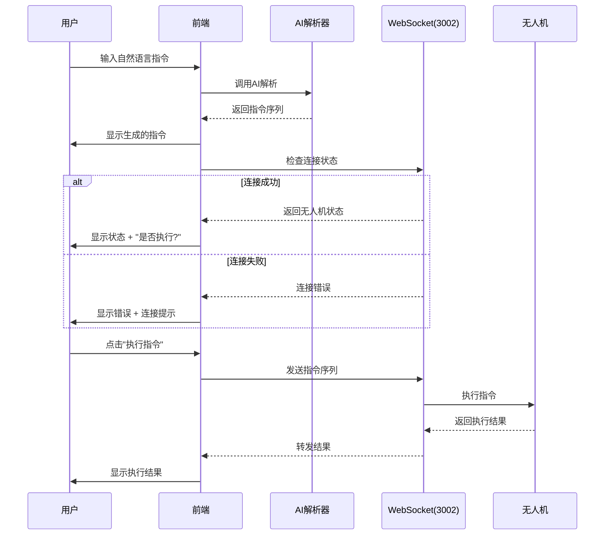
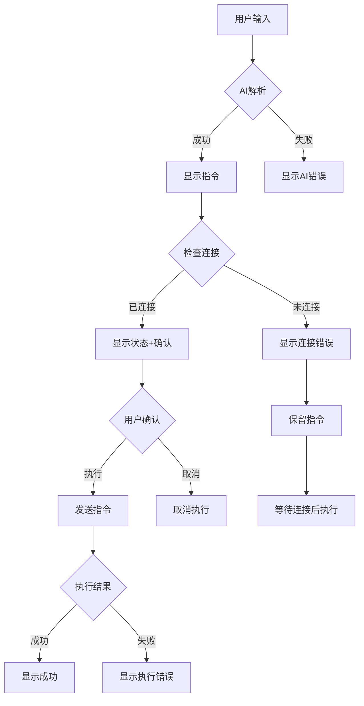

# Tello智能代理移除3004后端依赖

## 修改概述

本次修改将Tello智能代理的架构从依赖3004后端改为纯前端AI解析 + 3002无人机后端的模式。

## 主要变更

### 1. 移除3004后端依赖

**之前的架构:**
```
用户输入 → 前端 → 3004后端(AI解析) → 3002后端(无人机控制)
```

**现在的架构:**
```
用户输入 → 前端(AI解析) → 询问用户确认 → 3002后端(无人机控制)
```

### 2. 新增用户确认流程

AI分析完成后，系统会：

1. **检查无人机连接状态**
   - 尝试连接到3002端口的无人机后端
   - 获取无人机实时状态（电量、高度、飞行状态等）

2. **根据连接状态显示不同提示**

   **无人机已连接:**
   ```
   ✅ 无人机已连接
   
   📊 无人机状态:
   • 电量: 85%
   • 高度: 0cm
   • 飞行中: 否
   
   是否执行这些指令?
   ```

   **无人机未连接:**
   ```
   ⚠️ 无人机未连接
   错误: 连接超时
   
   请确保:
   1. 无人机已开机
   2. 已连接到无人机WiFi
   3. 后端服务正在运行 (端口 3002)
   
   连接成功后可以执行这些指令。
   ```

3. **用户确认执行**
   - 显示"执行指令"和"取消"按钮
   - 只有用户点击"执行指令"后才会真正发送命令到无人机

### 3. 代码优化

- 移除了未使用的 `connectionStatus` 状态
- 移除了未使用的 `validateCommand` 函数
- 调整了函数声明顺序，避免循环依赖
- 简化了WebSocket连接逻辑

## 工作流程

### 完整执行流程



### 错误处理流程



## 关键代码说明

### 1. AI解析 (前端)

```typescript
const analyzeWithAI = async (userCommand: string) => {
  if (!aiParserRef.current) {
    return { success: false, error: 'AI 解析器未初始化' };
  }

  const result = await aiParserRef.current.parse(userCommand);
  
  if (result.success && result.data) {
    return {
      success: true,
      commands: result.data.commands,
      reasoning: result.data.reasoning
    };
  }
  
  return { success: false, error: result.error };
};
```

### 2. 连接状态检查

```typescript
const checkDroneConnection = async () => {
  try {
    // 尝试连接到无人机后端
    const ws = await connectToDroneBackend();
    
    // 等待状态更新 (最多3秒)
    return new Promise((resolve) => {
      const timeout = setTimeout(() => {
        resolve({
          connected: true,
          status: droneStatus || undefined
        });
      }, 3000);

      if (droneStatus) {
        clearTimeout(timeout);
        resolve({
          connected: true,
          status: droneStatus
        });
      }
    });
  } catch (error) {
    return {
      connected: false,
      error: error.message
    };
  }
};
```

### 3. 用户确认流程

```typescript
const handleSend = async () => {
  // 1. AI解析
  const result = await analyzeWithAI(input);
  
  if (result.success && result.commands) {
    // 2. 显示生成的指令
    setMessages([...messages, {
      role: 'assistant',
      content: '我已经为你生成了以下指令序列:',
      commands: result.commands
    }]);
    
    // 3. 检查连接状态
    const connectionCheck = await checkDroneConnection();
    
    // 4. 显示确认消息
    if (connectionCheck.connected) {
      setMessages([...messages, {
        role: 'assistant',
        content: `✅ 无人机已连接\n\n是否执行这些指令?`
      }]);
    } else {
      setMessages([...messages, {
        role: 'assistant',
        content: `⚠️ 无人机未连接\n\n请检查连接后重试。`
      }]);
    }
    
    // 5. 保存待执行指令
    setPendingCommands(result.commands);
  }
};
```

### 4. 执行指令

```typescript
const handleExecute = async () => {
  if (!pendingCommands) return;
  
  // 再次检查连接
  const connectionCheck = await checkDroneConnection();
  
  if (!connectionCheck.connected) {
    setMessages([...messages, {
      role: 'assistant',
      content: '❌ 无法执行指令: 无人机未连接'
    }]);
    return;
  }
  
  // 执行指令序列
  const ws = await connectToDroneBackend();
  
  for (const command of pendingCommands) {
    ws.send(JSON.stringify({
      type: 'drone_command',
      data: {
        action: command.action,
        parameters: command.params || {}
      }
    }));
    
    await waitForCommandResult(command.action, ws);
  }
};
```

## 优势

### 1. 简化架构
- 减少了一个后端服务（3004端口）
- 降低了系统复杂度和维护成本
- 减少了网络延迟

### 2. 提升安全性
- 用户可以在执行前查看和确认指令
- 避免误操作导致的危险飞行
- 可以在执行前检查无人机状态

### 3. 更好的用户体验
- 实时显示无人机连接状态
- 清晰的错误提示和解决方案
- 支持取消执行和紧急停止

### 4. 灵活性
- 用户可以选择不执行某些指令
- 可以在连接恢复后再执行
- 支持从历史记录重新执行

## 使用示例

### 示例1: 正常执行流程

```
用户: 起飞后向前飞50厘米
AI: 我已经为你生成了以下指令序列:
    1. takeoff - 起飞
    2. forward - 向前飞行 (distance: 50)
    
✅ 无人机已连接

📊 无人机状态:
• 电量: 85%
• 高度: 0cm
• 飞行中: 否

是否执行这些指令?

[执行指令] [取消]

用户点击"执行指令"

✈️ 正在执行指令...
进度: 1 / 2
进度: 2 / 2

执行完成! 成功: 2/2
```

### 示例2: 无人机未连接

```
用户: 起飞
AI: 我已经为你生成了以下指令序列:
    1. takeoff - 起飞
    
⚠️ 无人机未连接
错误: 连接超时

请确保:
1. 无人机已开机
2. 已连接到无人机WiFi
3. 后端服务正在运行 (端口 3002)

连接成功后可以执行这些指令。

[执行指令] [取消]

(指令被保留，用户可以在连接恢复后点击"执行指令")
```

### 示例3: 执行中紧急停止

```
用户: 向前飞100厘米
AI: 生成指令...

✅ 无人机已连接
是否执行?

用户点击"执行指令"

✈️ 正在执行指令...
进度: 1 / 1

用户点击"紧急停止"

已发送紧急停止指令!
```

## 配置说明

### AI配置参数

```typescript
<TelloIntelligentAgentChat
  // AI提供商
  aiProvider="openai"
  aiModel="gpt-4"
  aiApiKey="your-api-key"
  
  // 可选: 自定义API端点
  aiBaseUrl="https://api.openai.com/v1"
  
  // 可选: 温度和最大token
  temperature={0.1}
  maxTokens={1000}
  
  // WebSocket配置 (仅3002端口)
  droneBackendUrl="ws://localhost:3002"
  
  // 回调函数
  onCommandsGenerated={(commands) => console.log('生成指令:', commands)}
  onExecutionComplete={(results) => console.log('执行结果:', results)}
  onStatusUpdate={(status) => console.log('状态更新:', status)}
/>
```

### 支持的AI提供商

- OpenAI (gpt-4, gpt-3.5-turbo)
- Anthropic (claude-3-opus, claude-3-sonnet)
- Google (gemini-pro)
- Ollama (本地模型)
- Qwen (通义千问)
- DeepSeek
- Azure OpenAI
- Groq
- Mistral
- OpenRouter

## 故障排除

### 问题1: AI解析失败

**症状:** 显示"抱歉,我无法理解你的指令"

**解决方案:**
1. 检查AI API密钥是否正确
2. 检查网络连接
3. 尝试更简单的指令
4. 查看浏览器控制台的错误信息

### 问题2: 无人机连接失败

**症状:** 显示"⚠️ 无人机未连接"

**解决方案:**
1. 确保无人机已开机
2. 连接到无人机WiFi (TELLO-XXXXXX)
3. 确保后端服务正在运行: `python drone_backend.py`
4. 检查防火墙设置

### 问题3: 指令执行超时

**症状:** 显示"命令执行超时"

**解决方案:**
1. 检查无人机电量是否充足
2. 确保无人机在安全的飞行环境
3. 重启无人机和后端服务
4. 减少指令序列的长度

## 未来改进

1. **批量执行优化**
   - 支持并行执行某些指令
   - 智能调整指令间延迟

2. **更智能的连接管理**
   - 自动重连机制
   - 连接质量监控

3. **增强的安全检查**
   - 飞行区域限制
   - 电量预警
   - 碰撞检测

4. **更丰富的反馈**
   - 实时视频流
   - 3D飞行轨迹可视化
   - 详细的执行日志

## 相关文档

- [Tello AI Parser Guide](./TELLO_AI_PARSER_GUIDE.md)
- [Command History Feature](./COMMAND_HISTORY_FEATURE.md)
- [Tello Error Handling](./TELLO_ERROR_HANDLING_COMPLETE.md)
- [WebSocket Integration](./WEBSOCKET_STATUS_SUBSCRIPTION.md)

## 更新日志

### 2024-01-XX
- ✅ 移除3004后端依赖
- ✅ 添加用户确认流程
- ✅ 优化连接状态检查
- ✅ 改进错误处理
- ✅ 清理未使用代码
