# YOLO模型热插拔 - 前端集成文档

## 📋 概述

YOLO模型热插拔功能允许用户在无需重启服务的情况下，动态上传、切换和管理YOLO检测模型。

## 🎯 功能特性

- ✅ **运行时热插拔** - 无需重启即可切换模型
- ✅ **多模型管理** - 支持多个模型并存
- ✅ **可视化界面** - 友好的管理界面
- ✅ **默认草莓模型** - 预装草莓成熟度检测模型
- ✅ **自定义模型** - 支持上传自定义YOLO模型

## 📁 文件结构

```
drone-analyzer-nextjs/
├── app/
│   ├── api/
│   │   └── models/
│   │       └── hot-swap/
│   │           └── route.ts              # API路由
│   └── model-manager/
│       └── page.tsx                      # 独立管理页面
├── components/
│   ├── YOLOModelManager.tsx              # 完整管理组件
│   └── ModelSwitcher.tsx                 # 紧凑型切换器
└── hooks/
    └── useYOLOModels.ts                  # React Hook
```

## 🚀 使用方法

### 1. 独立管理页面

访问 `/model-manager` 页面，可以进行完整的模型管理：

```typescript
// 访问路径
http://localhost:3000/model-manager
```

### 2. 在任意页面中嵌入管理组件

```typescript
import YOLOModelManager from '@/components/YOLOModelManager';

export default function MyPage() {
  return (
    <div>
      <YOLOModelManager />
    </div>
  );
}
```

### 3. 紧凑型模型切换器

```typescript
import ModelSwitcher from '@/components/ModelSwitcher';

export default function DroneControlPage() {
  return (
    <div>
      {/* 显示模型切换下拉框和管理按钮 */}
      <ModelSwitcher />
      
      {/* 或者不显示管理按钮 */}
      <ModelSwitcher showManageButton={false} />
    </div>
  );
}
```

### 4. 使用React Hook

```typescript
import { useYOLOModels } from '@/hooks/useYOLOModels';

export default function CustomComponent() {
  const { 
    models,           // 所有模型列表
    activeModel,      // 当前活动模型
    loading,          // 加载状态
    error,            // 错误信息
    loadModels,       // 刷新模型列表
    switchModel,      // 切换模型
    deleteModel,      // 删除模型
    uploadModel       // 上传模型
  } = useYOLOModels();

  return (
    <div>
      <h3>当前模型: {activeModel?.name}</h3>
      <button onClick={() => switchModel('model_id')}>
        切换模型
      </button>
    </div>
  );
}
```

## 🔌 API接口

### 获取模型列表

```typescript
// GET /api/models/hot-swap
const response = await fetch('/api/models/hot-swap');
const { success, data } = await response.json();

// 返回格式
{
  "success": true,
  "data": {
    "type": "models_list",
    "models": [
      {
        "id": "strawberry_default",
        "name": "草莓成熟度检测",
        "type": "strawberry",
        "path": "/path/to/model.pt",
        "classes": ["unripe", "semi_ripe", "ripe", "overripe"],
        "loaded_at": "2025-10-09T14:30:52",
        "is_default": true,
        "is_active": true
      }
    ]
  }
}
```

### 切换模型

```typescript
// POST /api/models/hot-swap
const response = await fetch('/api/models/hot-swap', {
  method: 'POST',
  headers: { 'Content-Type': 'application/json' },
  body: JSON.stringify({
    action: 'switch',
    model_id: 'user_1234567890_custom_model'
  })
});

// 返回格式
{
  "success": true,
  "data": {
    "type": "model_switched",
    "success": true,
    "message": "已切换到模型: Custom Model"
  }
}
```

### 上传模型

```typescript
const response = await fetch('/api/models/hot-swap', {
  method: 'POST',
  headers: { 'Content-Type': 'application/json' },
  body: JSON.stringify({
    action: 'upload',
    model_path: 'C:/models/my_model.pt',
    model_name: '我的检测模型',
    model_type: 'custom'
  })
});

// 返回格式
{
  "success": true,
  "data": {
    "type": "model_uploaded",
    "success": true,
    "message": "模型 '我的检测模型' 上传成功",
    "model_id": "user_1728456789_my_model"
  }
}
```

### 删除模型

```typescript
const response = await fetch('/api/models/hot-swap', {
  method: 'POST',
  headers: { 'Content-Type': 'application/json' },
  body: JSON.stringify({
    action: 'delete',
    model_id: 'user_1234567890_custom_model'
  })
});

// 返回格式
{
  "success": true,
  "data": {
    "type": "model_deleted",
    "success": true,
    "message": "模型已删除: Custom Model"
  }
}
```

## 🎨 UI组件说明

### YOLOModelManager（完整版）

**功能**:
- 显示所有已加载的模型
- 上传新模型
- 切换活动模型
- 删除自定义模型
- 显示模型详细信息

**Props**: 无

**使用场景**: 专门的模型管理页面

### ModelSwitcher（紧凑版）

**功能**:
- 快速切换模型下拉框
- 显示当前活动模型信息
- 可选的管理按钮链接

**Props**:
```typescript
interface ModelSwitcherProps {
  className?: string;        // 自定义样式类
  showManageButton?: boolean; // 是否显示管理按钮（默认true）
}
```

**使用场景**: 嵌入到无人机控制面板或主界面

## 💡 集成到主页面示例

```typescript
'use client';

import { useState } from 'react';
import ModelSwitcher from '@/components/ModelSwitcher';
import DroneControlPanel from '@/components/DroneControlPanel';

export default function HomePage() {
  return (
    <div className="p-6">
      {/* 顶部工具栏 */}
      <div className="mb-4 flex justify-between items-center">
        <h1 className="text-2xl font-bold">无人机控制</h1>
        
        {/* 模型切换器 */}
        <ModelSwitcher className="w-96" />
      </div>

      {/* 无人机控制面板 */}
      <DroneControlPanel />
      
      {/* 视频流（会使用当前选中的模型进行检测） */}
      <VideoStream />
    </div>
  );
}
```

## 🔄 工作流程

### 上传和使用自定义模型

1. **准备模型文件**
   - 确保模型是YOLOv8或YOLOv11的`.pt`格式
   - 将模型文件保存到本地路径

2. **上传模型**
   - 访问模型管理页面或使用上传API
   - 填写模型名称和文件路径
   - 选择模型类型（custom/strawberry/object_detection）

3. **切换模型**
   - 在模型列表中点击"切换"按钮
   - 或使用下拉框快速切换

4. **开始检测**
   - 启动视频流
   - 视频流将自动使用新模型进行检测

### 模型切换流程

```mermaid
graph LR
    A[用户点击切换] --> B[发送切换请求]
    B --> C[后端热插拔模型]
    C --> D[更新活动模型]
    D --> E[视频流使用新模型]
    E --> F[前端显示新检测结果]
```



## ⚙️ 配置说明

### 模型类型

| 类型 | 说明 | 示例 |
|------|------|------|
| `strawberry` | 草莓成熟度检测 | 4级成熟度分类 |
| `custom` | 自定义模型 | 用户训练的任意YOLO模型 |
| `object_detection` | 通用目标检测 | COCO等数据集训练的模型 |

### 模型元数据

```typescript
interface YOLOModel {
  id: string;              // 唯一ID
  name: string;            // 显示名称
  type: string;            // 模型类型
  path: string;            // 文件路径
  classes: string[];       // 检测类别列表
  loaded_at: string;       // 加载时间（ISO格式）
  is_default: boolean;     // 是否为默认模型
  is_active: boolean;      // 是否为当前活动模型
}
```

## 🐛 故障排除

### 问题：模型列表为空

**原因**: 后端未启动或WebSocket连接失败

**解决方案**:
1. 确保后端服务已启动: `python unified_drone_backend.py`
2. 检查WebSocket连接: `ws://localhost:3002`
3. 查看浏览器控制台错误信息

### 问题：上传失败

**原因**: 模型文件路径错误或格式不支持

**解决方案**:
1. 确认文件路径正确且文件存在
2. 确认模型是`.pt`格式
3. 确认模型是YOLOv8/YOLOv11训练的

### 问题：切换后检测无变化

**原因**: 视频流未使用新模型

**解决方案**:
1. 停止并重新启动视频流
2. 检查后端日志确认模型已切换
3. 刷新页面重新连接WebSocket

## 📊 性能考虑

### 模型大小

- 小型模型（< 20MB）: 切换几乎无延迟
- 中型模型（20-100MB）: 切换需1-2秒
- 大型模型（> 100MB）: 切换需3-5秒

### 内存占用

每个加载的模型会占用内存，建议：
- 最多同时加载3-5个模型
- 删除不使用的模型释放内存
- 大型模型建议使用GPU加速

## 🔒 安全注意事项

1. **文件路径验证**: 前端应验证用户输入的路径
2. **权限控制**: 生产环境应增加用户权限验证
3. **模型验证**: 上传前应验证模型文件完整性

## 📚 相关文档

- [后端API文档](../python/README.md)
- [YOLO模型训练指南](./yolo_training.md)
- [前端开发规范](../.cursorrules)

---

**更新时间**: 2025-10-09  
**版本**: v1.0  
**维护者**: 前端团队


